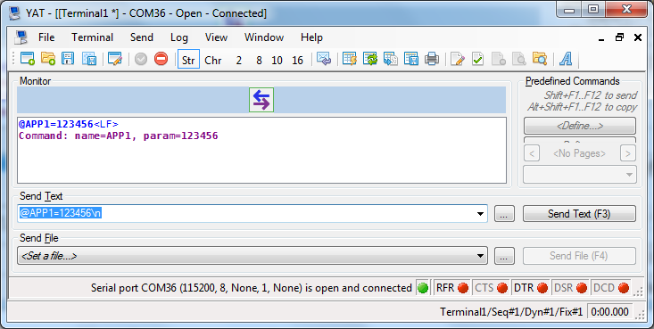
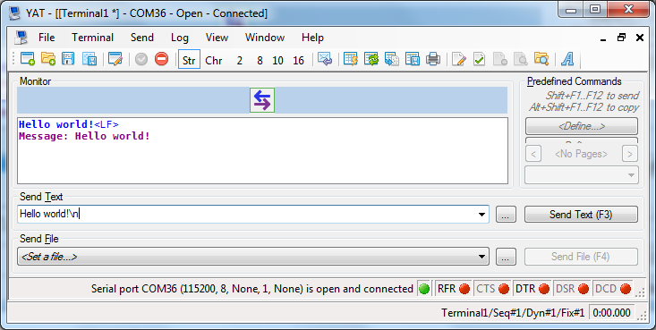
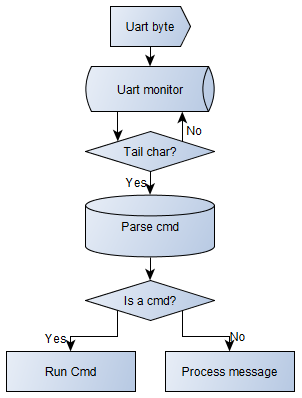

# uart-command-parser
Concerning debugging in the embedded application, a common method is to change the input value by hitting the button. 

Generally, a button has only two available values: hit and unhit, which means we can provide only two different input for testing.

But in many cases, I would like to input as many values as I want in the testing. That's why I make this project.

With this project, actually it's only a set of .c and .h files, firmware needs to provide a set of command and handler, user inputs the command in UART terminal and firmware executes the handler.

## Usage

The basic usage is:

`@` `command_string` `=` `command_parameter` `\n`

A command is a string with the length less than 5 bytes.

The total length of user input string should be less than 64 bytes.

The string is ended by '\n'(0x0A)

If typing string without prefix `@`, it will be parsed as **MESSAGE**. Message will be printed out immediately in current project. (If we route the message to BLE notification API, it is a BLE-UART passthrough.)

## Example

I prepare three sets of command in my applicaiton code:

- {"APP1", appHandler1}
- {"APP2", appHandler2}
- {"APP3", appHandler3} 

In the UART terminal, if typing `@APP1=123456`, then appHandler1 will be invoked with parameter "123456", as shown in the following figure:

If typing a stirng without `@` prefix, we can see the echo string:

## Flow

UART is the core of this system. It monitors the input byte stream continousely and save bytes in a buffer. Once finding a tail tag('\n'), parse and process it.

- Uart Monitor: It's the UART RX interrupt.
- Parser cmd: Once it find a command, push it to a task queue. So it has potential to process complex task which may consume multiple steps.
- Run cmd: It's nothing, but in the background, it implements a simple event-listener design mode.

## Note

This project is **half-complete.** It can run basically, however, I don't take enough tests on it.

Unfortunately, I don't have time(or chance) to improve it anymore based on PSoC chip. :-(

I think it's still helpful if someone wants to implement an event-listener(or produce-consume or sometimes describe-delivery) design mode.

(End)